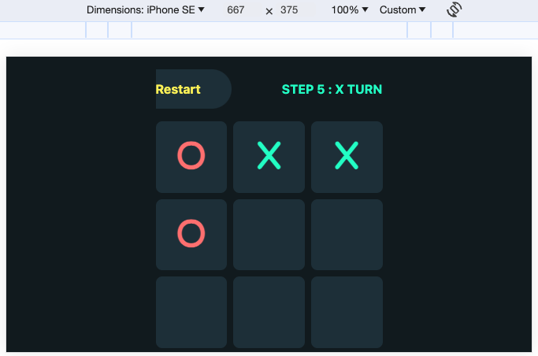
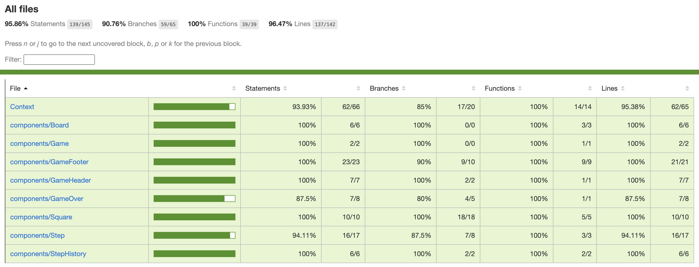

# TIC TAC TOE GAME

Tic Tac Toe: 3x3 grid, two players, "X" and "O" marks. Aim to get three in a row—horizontal, vertical, or diagonal—before your opponent. Simple, quick, and timeless fun for all.

## Wireframe

Open [Tic Tac Toe UI Figma link](https://www.figma.com/file/VeDydiKrVYsVYySPiJNBY2/Tic-Tac-Toe-Melody?type=design&node-id=0%3A1&mode=design&t=XgTqHA2kE7aI39OB-1) to view UI using Figma

## Installation

### Clone

- Clone this repo to your local machine using `https://github.com/Melody-Le/tic-tac-toe-ncs.git`

### Setup

> Install dependencies

```shell
npm i
```

> Run the app in development mode

```shell
npm start
```

> Jest Launch in watch mode

```shell
npm test
```

## 2. Demo

### Different screen sizes

| Extra small devices (portrait phones, less than 576px)                      | Small devices (landscape phones, 576px and up)                    | Medium devices (tablets, 768px and up)                              | Large devices (desktops, 992px and up)                            |
| --------------------------------------------------------------------------- | ----------------------------------------------------------------- | ------------------------------------------------------------------- | ----------------------------------------------------------------- |
|  |  |  |  |

[](https://www.youtube.com/watch?v=tMRzaXXHZ3c)

### Game Flow

[](https://www.youtube.com/watch?v=2rhGlDuRRNw)

### Test Coverage



## 3. Built With

- Core

  - [React](https://legacy.reactjs.org/) - A JavaScript library to building user interfaces for web and native user interfaces
  - [Styled Components](https://www.styled-components.com/docs) - Library for creating CSS in JS

- Test
  - [react-testing-library](https://github.com/testing-library/react-testing-library) - lightweight solution for testing React components. It provides light utility functions on top of react-dom and react-dom/test-utils,
